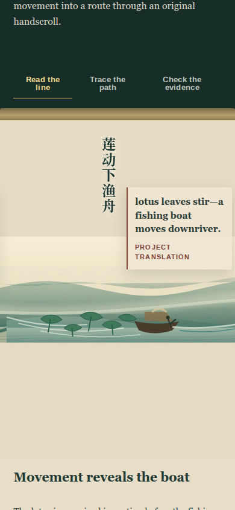
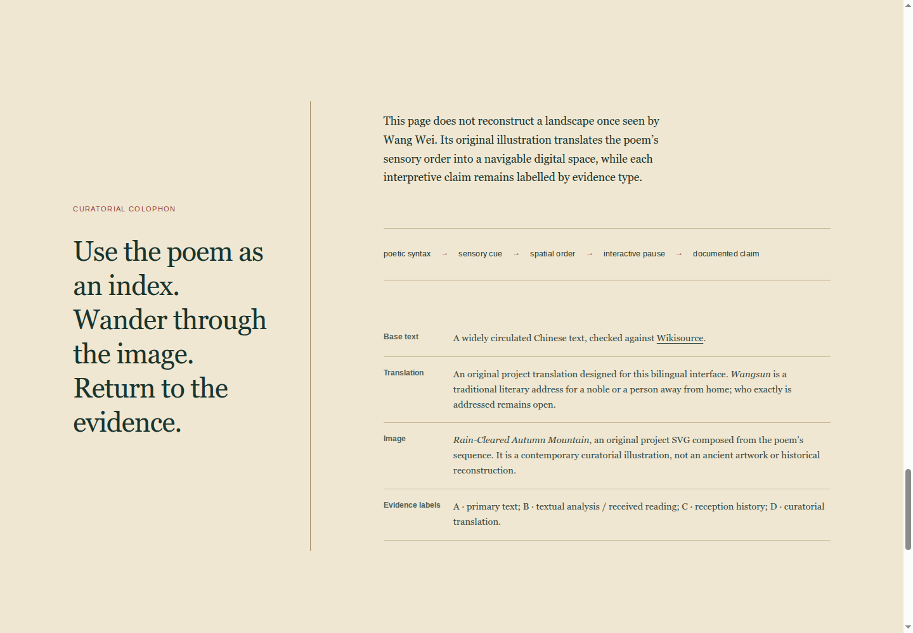

# 产品简介

本网页是一场围绕王维《山居秋暝》的数字文化专题展。用户通过启卷、横向游览、阅读层切换、诗歌语法地图、文本证据和材料工坊，理解诗歌如何由“空山”逐步走向“自可留”。

网页无需安装软件。`index.html` 是英文主入口，中文原诗与项目英译并置；`zh.html` 是中文入口。两页都可直接打开，也可通过 GitHub Pages 链接访问。

# 1. 首页与启卷

{ width=100% }

首页展示主题、作者、体裁和策展问题。

## 操作

1. 英文页点击 **“Enter the mountain”**；中文页点击 **“入山·启卷”**。
2. 卷首画心会展开。
3. 页面自动进入“循诗入山”区域。

页面注明画面是策展性视觉转译，并非王维实景复原。

# 2. 浏览横向手卷

{ width=100% }

## 桌面端

- **鼠标滚轮：**光标位于手卷上时，上下滚轮转换为横向移动。
- **拖动：**按住手卷并左右拖动。
- **键盘：**手卷获得焦点后，使用左右方向键。
- **连续进度条：**拖动范围条查看卷内任意位置。
- **六站定位：**点击 Rain / Moon / Spring / Bamboo / Lotus / Remain 中任一站，准确跳到对应诗句与画面。

## 移动端

{ width=45% }

- 在画心区域左右滑动。
- 页面使用轻度停驻，不强制逐屏翻页。
- 卷外题跋显示在画面下方，不遮挡画心。

## 进度说明

进度同时显示当前联和停驻点；英文页例如 “THIRD · 04/06”，中文页例如“颈联·04/06”。六个停驻点分别属于首联、颔联、颈联和尾联。

六个分段按钮会以颜色和 `aria-current` 标记当前站。连续拖动适合自由游卷；分段按钮适合课堂演示和直接比较两句诗。

# 3. 切换三种阅读层

{ width=100% }

手卷上方有三个按钮：

| 阅读层 | 功能 |
|---|---|
| 读诗句 / Read the line | 查看当前诗句的感官、语序和动作分析 |
| 看路径 / Trace the path | 查看网页如何借图像空间转译文本 |
| 查依据 / Check the evidence | 查看证据等级、翻译选择和研究边界 |

点击按钮后，卷外题跋更新。按钮状态会通过颜色和 ARIA 属性同步变化。

# 4. 阅读诗的语法地图

{ width=100% }

语法地图说明网页为何采用当前顺序：

1. 首联建立环境。
2. 颔联建立感官空间。
3. 颈联从迹象发现人物和舟行。
4. 尾联从景物转入选择。

中英文页面在移动端都纵向排列四段路径，便于连续讲解并避免小字横向卡片。

# 5. 查看文本与接受史证据

{ width=100% }

该区域包含三项材料：

- 《招隐士》与“王孙自可留”的文本回声。
- 《鹿柴》《竹里馆》的作者内部比较。
- 苏轼题跋与后世“以画读诗”的接受史。

每项均提供“为什么在这里”、证据等级、研究边界和核对链接。英文主入口在移动端纵向排列证据卡；中文页可横向滑动主证与旁证。

# 6. 使用画外转译工坊

{ width=100% }

## 查看真实标本

左侧展示 CC0 蓝铜矿标本图，并标明来源。

## 切换概念层

依次点击：

- 结构概念层
- 石绿概念层
- 石青概念层

右侧示意图会叠加或隐藏对应颜色。该功能用于解释视觉层次，不代表古画固定工序。

# 7. 查看策展方法与来源

{ width=100% }

题跋区列出：

- 文本核对来源
- 原创 SVG 手卷的媒介说明与蓝铜矿图片授权
- A／B／C／D 证据分级
- 原创策展图像与诗歌原文之间的研究边界
- “诗句语法→感官线索→空间次序→交互停驻→证据说明”的方法链

# 8. 顶部导航

桌面端英文导航为 Scroll / Grammar / Texts / Medium / Method；中文页对应导航包括：

- 游卷
- 语法
- 文本
- 矿彩
- 题跋 / Method
- 中英文切换（EN / 中文版）

移动端点击右上角菜单按钮展开导航。选择任意项目后菜单自动关闭。

# 9. 键盘与无障碍功能

- 页面提供“跳至展览”的跳过链接。
- 交互按钮具有可见键盘焦点。
- 手卷支持左右方向键。
- 三阅读层和材料按钮维护 `aria-pressed` 状态。
- 动效遵守 `prefers-reduced-motion`。
- 来源链接除颜色外还使用下划线识别。

# 10. 常见问题

## 页面打开后图片较慢

长卷使用本项目原创 SVG，文件较小且可随屏幕缩放；若未显示，请确认 `assets/handscroll/autumn-mountain-scroll.svg` 与页面相对路径保持一致。

## 鼠标滚轮没有横向移动

请将光标移入手卷画心区域后再滚动。也可以拖动手卷或下方进度条。

## 手机上不知道如何前进

在画心区域向左滑动，或直接点击下方六站定位条。当前联和停驻点会显示在进度区域。

## 材料按钮可以同时开启吗

可以。三个按钮用于比较不同概念层，可单独开启，也可叠加查看。

## 外部来源链接需要网络吗

需要。网页主体可离线打开，但 Wikisource 与蓝铜矿 Wikimedia Commons 核对链接需要联网。

# 11. 部署维护

正式部署方式见项目根目录 `DEPLOYMENT.md`。网页更新后推送到 GitHub 的 `main` 分支，GitHub Actions 会自动更新 Pages 链接。
