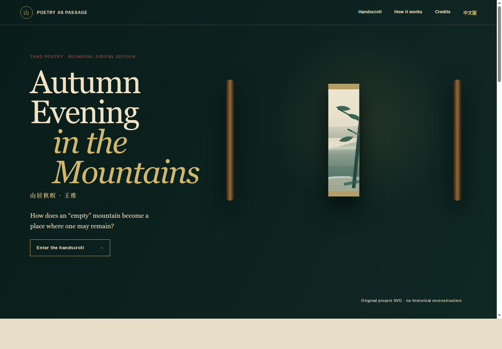

# 页面是什么

这是围绕王维《山居秋暝》制作的双语数字手卷。简化版不再铺陈大量文化模块，只保留一条清楚的体验路径：**进入手卷 → 浏览六个诗句停驻点 → 切换三种解释 → 认识王维 → 延伸阅读**。

`index.html` 是英文主入口，`zh.html` 是中文辅助入口。两页共享同一份 CSS、JavaScript 与原创 SVG 手卷，可直接本地打开，也可部署到 GitHub Pages。

{ width=100% }

# 1. 进入手卷

点击 **Enter the handscroll / 进入手卷**。卷首预览展开，页面进入核心手卷。该动画只表达“开始观看”，不会自动播放声音或持续制造视觉干扰。

# 2. 浏览六个停驻点

手卷提供四种等价操作：

- 在画心上按住鼠标左右拖动，手机上左右滑动；
- 桌面端把鼠标放在手卷上滚动；
- 拖动手卷下方的连续进度条；
- 点击 Rain、Moon、Spring、Bamboo、Lotus、Remain 六个按钮直接定位。

每一站都把中文诗句、英文翻译与对应图景放在同一视口。下方数字显示当前位置，例如 `06 / 06`；当前按钮同时带有颜色与 `aria-current` 标记。

# 3. 切换解释视角

手卷上方只保留三种阅读按钮：

- **Read / 读诗句：**说明语序、感官和动作；
- **Visualise / 看转译：**说明网页如何把语言转成空间；
- **Boundary / 查边界：**说明翻译选择和研究边界。

切换按钮只更新右侧题跋，不打断手卷位置，因此可以在同一句上比较三种说明。

# 4. 认识诗人

页面下半部分展示清代李瀛所绘王维像，并简要介绍王维的多重身份与山水诗特点。展签明确说明这是一幅后世文化肖像，并非唐代写实画像。

# 5. 中英文与移动端

顶部 `中文版 / EN` 可切换语言。手机端点击右上角菜单按钮展开导航；选择链接后菜单自动关闭。手机上的手卷、解释题跋、进度条和六站按钮改为纵向顺序，不需要缩放页面。

# 6. 来源与边界

页面末尾提供四条延伸阅读路径：维基文库原诗、Poetry Foundation 王维页面、中国哲学书电子化计划与 Wikimedia Commons 画像档案。原创画卷仍明确标注为诗句的视觉转译，不是古画，也不声称复原王维见过的真实地点。

# 7. 建议的课堂操作顺序

1. 用首页问题介绍项目，点击启卷。
2. 点击 Moon、Bamboo、Remain，展示诗歌由自然感官走向人物痕迹和“可留”的判断。
3. 在 Remain 站依次切换 Read、Visualise、Boundary。
4. 滚动到王维介绍，再通过页尾链接打开原诗或诗人生平资料。
5. 用中文页或手机视口说明共享代码与响应式设计。

完整旧版已保存在 Git 标签与归档分支 `full-exhibition-v1`，简化工作不会覆盖原版本。
