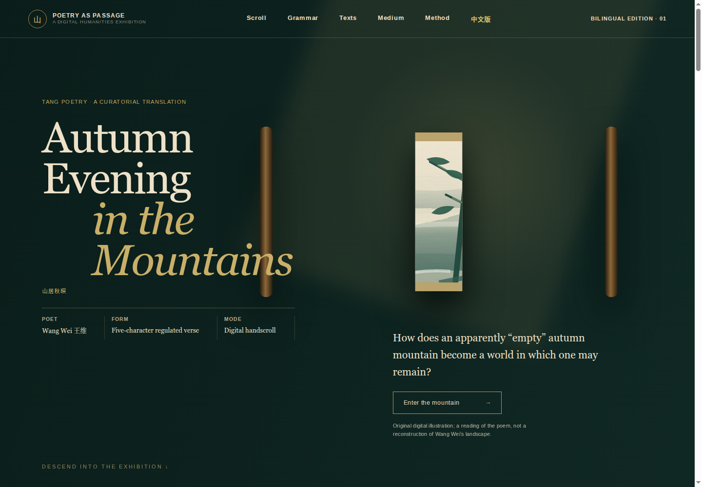
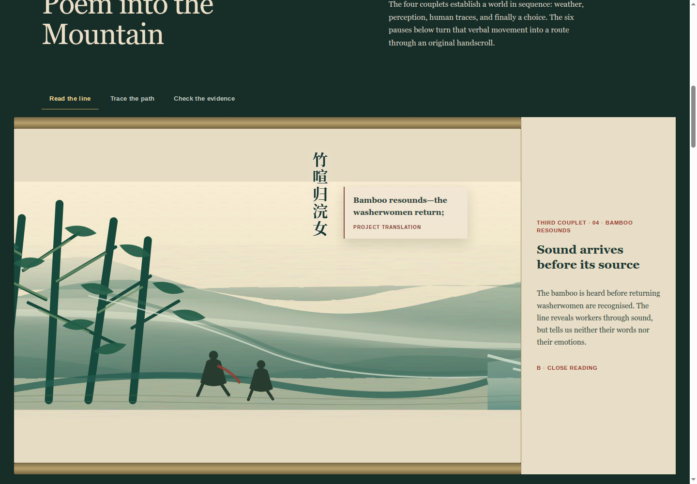
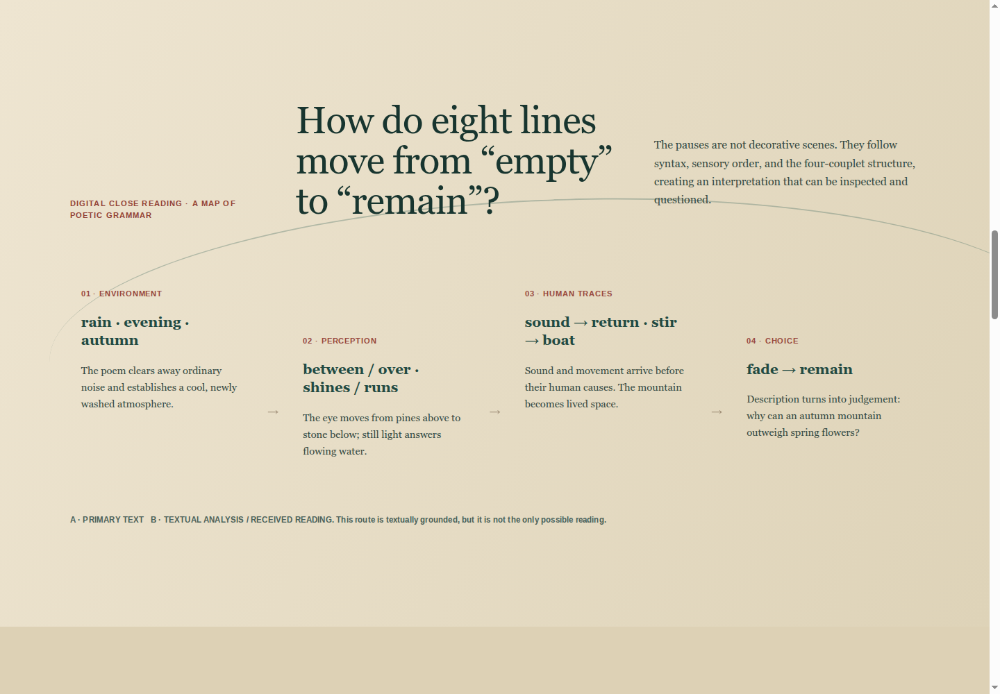
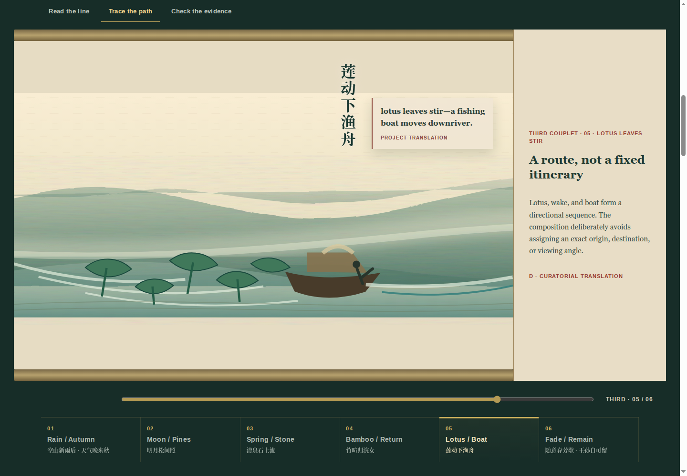
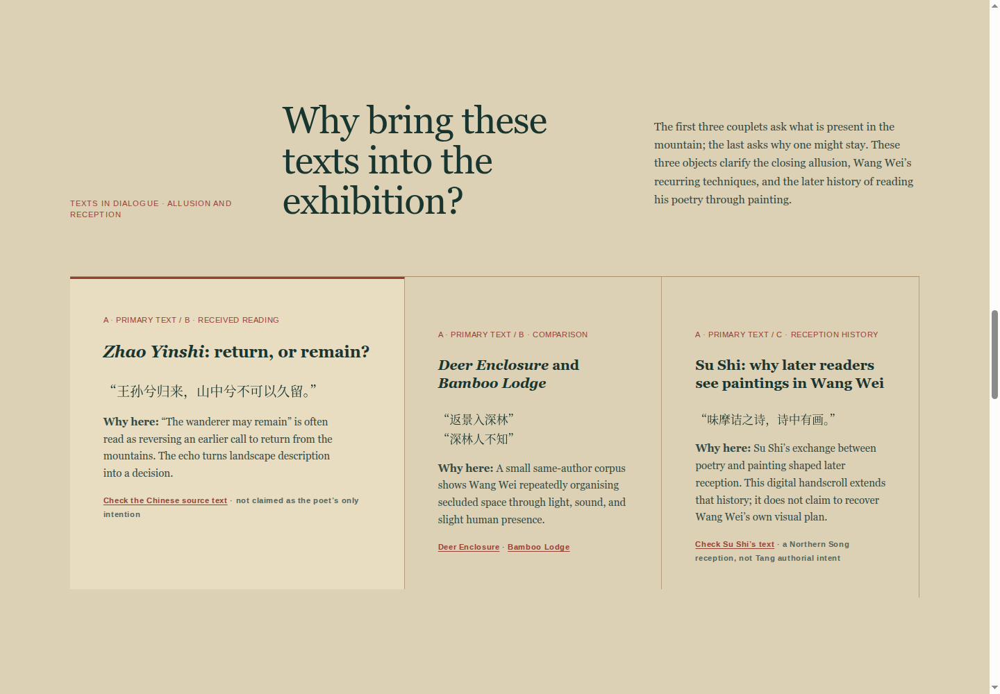
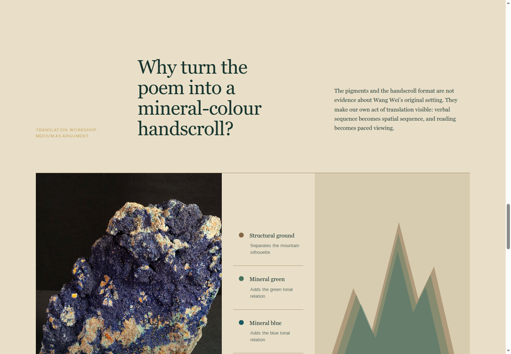

# 这份汇报讲什么

本项目是一个可以直接部署到 GitHub Pages 的双语诗歌网页。汇报不把重点放在“网页收集了多少文化知识”，而放在一个更适合本课程的问题上：

> 我们如何用基础 HTML、CSS 和 JavaScript，把一首八句诗转成可以展开、定位和解释的数字手卷？

{ width=100% }

正式入口是 `index.html`，使用英文界面并同时显示中文原诗与项目英译；`zh.html` 是中文备用入口。项目没有框架、构建工具和第三方动画库，所有核心实现都可以由学生直接从源码讲清楚。

# 为什么只讲四项代表性技术

网页实际包含首页、横卷、六段定位、解释层、语法地图、文本材料、颜色层和响应式布局。汇报不需要为每个模块发明一种新技术，而是让多个模块复用四项基础能力：

| 代表性技术 | 解决的问题 | 页面中的例子 |
|---|---|---|
| 1. 语义 HTML | 内容怎样分模块，图片和按钮怎样进入页面 | `section`、`article`、`img`、双语诗句、六站按钮 |
| 2. CSS 布局与视觉系统 | 怎样排版、美化并适配屏幕 | Grid、Flexbox、颜色变量、字体层级、媒体查询 |
| 3. CSS 状态动画 | 怎样实现一次有意义的启卷动作 | `clip-path`、`transition`、`.opened` 状态类 |
| 4. 原生 JavaScript 状态交互 | 怎样把位置、按钮和解释内容同步 | `data-stop`、事件监听、`scrollTo`、数组数据 |

这是有意的功能取舍：删除不稳定且难以解释价值的浏览器语音播放；不加入 React、D3、Canvas 或复杂视差；保留最能展示课程知识的结构、样式、动画和交互。

# 页面模块与文件对应

```text
index.html      英文页面结构与内容
zh.html         中文页面结构与内容
style.css       两个页面共享的布局、手卷、动画、响应式样式
style-en.css    英文排版的覆盖规则
app-en.js       英文手卷数据与交互
app.js          中文手卷数据与交互
assets/         原创 SVG 手卷和蓝铜矿图片
```

源码保持分工清楚：HTML 管内容，CSS 管呈现，JavaScript 管状态变化。现场演示时只需打开这几个文件，就能解释网页怎样工作。

# 技术一：语义 HTML 负责内容骨架

## 1. 用章节标签组织网页

首页、手卷、语法地图、文本证据、材料工坊和方法说明分别使用独立的 `section`。一幕诗画使用 `article`；引用原文使用 `blockquote`；导航使用 `nav`。

```html
<section class="exhibition" id="exhibition">
  <article class="scene" data-step="1">
    <div class="verse-cn" lang="zh-CN">空山新雨后</div>
    <div class="verse-en">After fresh rain ...</div>
  </article>
</section>
```

这样写的价值不只是“标签更规范”。CSS 和 JavaScript 都能根据这些结构准确找到一个模块，教师查看源码时也能直接理解页面层级。

## 2. 怎样插入图片

普通展品图片使用 ``：

```html

```

- `src` 使用相对路径，因此本地打开和 GitHub Pages 都能加载。
- `alt` 在图片无法显示或使用读屏软件时提供文字说明。
- 图片来源和授权放在可见展签中，而不是只写进代码注释。

长卷则作为 CSS 背景嵌入，因为它需要跨越六个连续场景：

```css
.handscroll::before {
  width: 600%;
  background: url("assets/handscroll/autumn-mountain-scroll.svg")
              center / 100% 100% no-repeat;
}
```

原创 SVG 画布严格分成六段，但山脚、雾和水脉穿过边界，因此视觉上仍是一卷连续画面。

# 技术二：CSS 完成布局、美化和响应式

## 1. 用变量统一色彩

```css
:root {
  --room: #102824;
  --silk: #e6dcc3;
  --ink: #18352f;
  --gold: #b18a43;
}
```

页面没有在每个模块任意选色，而是反复使用深墨绿、绢本、墨色和泥金。修改一个变量即可同步调整多个区域，更容易维护，也更容易说明设计选择。

## 2. Grid 和 Flexbox 各自做什么

- `Grid` 处理二维关系，例如“画心 + 卷外题跋”、语法地图和材料展柜。
- `Flexbox` 处理单一方向，例如顶部导航、横向六幕和移动端进度按钮。

{ width=100% }

手卷主体使用 `display:flex`，每个 `.scene` 恰好占一个可视画心的宽度；六幕总宽度就是六屏。这样点击第几站时，诗句与对应画面会完整进入同一视口。

## 3. 用排版层级保证可读性

中文原诗是展品层，使用深墨竖排；英文项目译文是解释层，使用半透明绢签；研究题跋位于画心之外。正文统一加深并增加字重，标签仍然较小，但不再用低对比度灰色充当装饰。

语法地图从深色低对比区域改为浅绢底与深墨文字，以一条河流曲线连接四个节点：

{ width=100% }

## 4. 媒体查询怎样适配手机

```css
@media (max-width: 720px) {
  .scroll-shell { grid-template-columns: 1fr; }
  .stop-picker { display: flex; overflow-x: auto; }
  .context-row { grid-template-columns: 1fr; }
}
```

移动端不是把桌面页面整体缩小，而是把题跋移到画心下方、让六站按钮可横向浏览、把证据卡改成单列，并保持中文竖排与英文横排。

# 技术三：用 CSS 状态实现启卷动画

首页的卷画并不是视频或 GIF，而是同一张图片在两个 CSS 状态之间过渡。

```css
.closed-scroll figure {
  clip-path: inset(0 43%);
  transition: clip-path 1.35s ease;
}

.prologue.opened .closed-scroll figure {
  clip-path: inset(0);
}
```

JavaScript 点击时只添加一个类：

```js
document.querySelector('.prologue').classList.add('opened');
```

这项动画具有明确目的：从“合卷”过渡到“观看”。它同时说明一个基础前端思想——JavaScript 改状态，CSS 决定状态看起来怎样。

为了照顾不希望看到动画的用户，页面还使用 `prefers-reduced-motion` 关闭过渡。

# 技术四：JavaScript 同步位置、导航和解释

## 1. 用数组保存六站内容

```js
const STOPS = [
  {
    tag: 'SECOND COUPLET · 02 · MOON BETWEEN PINES',
    poem: ['Light acquires direction', '...', 'B · CLOSE READING'],
    painting: ['Light is cut by pine branches', '...', 'D · CURATORIAL TRANSLATION']
  }
];
```

同一站的诗句细读、画面路径和研究边界集中存放。点击 “Read the line / Trace the path / Check the evidence” 时，页面只切换当前数据层，不复制三套 HTML。

## 2. 六段按钮怎样准确跳转

{ width=100% }

每个按钮带有 `data-stop`：

```html
<button data-stop="4">05 · Lotus / Boat</button>
```

JavaScript 读取目标场景的位置，再调用浏览器原生滚动：

```js
button.addEventListener('click', () => {
  const target = scenes[button.dataset.stop].offsetLeft;
  handscroll.scrollTo({ left: target, behavior: 'smooth' });
});
```

页面仍允许拖动、滚轮和范围条浏览，但六站按钮提供明确答案：现在位于哪一句、点击后会去哪一句。当前按钮用 `aria-current="true"` 与颜色同步标记。

## 3. 滚动位置怎样更新题跋

滚动时，程序比较当前位置与六个场景起点，找到最近的一站，然后同时更新：

- `OPENING / SECOND / THIRD / CLOSING` 进度文字；
- 六站按钮的当前状态；
- 卷外题跋的标题、正文和证据标签；
- 连续范围条的百分比。

这里展示的是一个有限但完整的状态同步：一次位置变化，驱动多个界面元素更新。

# 其他模块如何复用这四项技术

{ width=100% }

| 模块 | 没有新增复杂技术，而是复用 |
|---|---|
| 文本证据 | 语义 `article` + CSS Grid + 来源链接 |
| 材料颜色层 | HTML 按钮 + JavaScript 切换 class + CSS opacity |
| 中英文切换 | 两个静态 HTML 页面 + 普通相对链接 |
| 移动导航 | HTML button + CSS 媒体查询 + ARIA 状态 |
| GitHub Pages | 纯静态文件 + 一份 Actions 工作流 |

{ width=100% }

这种复用让项目看起来完整，但汇报时不需要声称使用许多高级框架。

# 功能取舍与学生身份

## 保留

- 一次启卷动画：用于讲清 CSS 状态与过渡。
- 一套六站定位：用于讲清 DOM、事件、位置计算和状态同步。
- 三个解释层：用于讲清数组数据与同源内容切换。
- 一个材料层开关：用于演示 class 与 CSS opacity。
- 响应式布局：用于展示媒体查询和移动端重排。

## 删除或不采用

- 浏览器语音播放：不同电脑声音和状态不稳定，也偏离本次技术汇报主线。
- 前端框架：项目规模不需要，反而增加无法在短时间讲清的抽象。
- 图表库、复杂 Canvas 和强视差：没有直接帮助诗句阅读。
- 外部字体和运行时图片请求：降低课堂网络风险。

选择少量技术并把每一项讲明白，比堆叠技术名称更符合学生项目的可信度。

# 建议的四分钟汇报顺序

| 时间 | 演示 | 技术重点 |
|---|---|---|
| 0:00–0:25 | 打开英文首页，说明项目目标 | 静态网站、文件分工 |
| 0:25–1:05 | 查看 HTML 源码和图片标签 | 语义标签、相对路径、`alt` |
| 1:05–1:55 | 点击启卷并展示横卷 | CSS Grid/Flex、变量、`clip-path` 动画 |
| 1:55–3:05 | 点击第 2、4、5 站和三个解释层 | `data-stop`、事件监听、`scrollTo`、数组状态 |
| 3:05–3:35 | 切换手机宽度 | 媒体查询、重新排版、无横向溢出 |
| 3:35–4:00 | 展示 GitHub Pages 链接 | 纯静态部署、无构建依赖 |

# 可直接使用的英文技术介绍

> We built the project as a dependency-free static website. Semantic HTML separates the poem, the six scroll scenes and the research notes. CSS Grid and Flexbox create the museum layout, while a short clip-path transition produces the unrolling animation. In JavaScript, one structured array stores the three interpretations for each stop. The current scroll position updates the note, the progress indicator and six direct-navigation buttons. We deliberately kept these techniques limited, so every interaction can be explained from the source code.

# 可能被问到的问题

## 为什么不用 React 或大型图表库？

页面只有一个主题和六个阅读停驻点，原生 HTML、CSS、JavaScript 已能清楚完成任务。少一层框架也更容易说明 DOM、样式和事件之间的关系。

## SVG 手卷是不是历史复原？

不是。它是根据诗句顺序绘制的当代界面资产。使用 SVG 是因为长卷需要在桌面和手机上保持清晰，并能通过一个本地文件部署。

## 为什么删除语音播放？

浏览器语音依赖操作系统，课堂机器上音色和状态不可控；它也不能说明历史声音。删除后，技术演示集中在更稳定、可解释的结构、样式、动画和交互。

## 和老师讲过的结构化文本有什么联系？

项目没有声称实现完整 TEI，但采用相同的基础思想：把原诗、项目翻译、分析、接受史和策展转译分开标记，而不是混成一段无结构文本。

# 部署与提交

项目已配置 `.github/workflows/pages.yml`。推送到 GitHub 的 `main` 分支，并在 **Settings → Pages** 选择 **GitHub Actions**，即可获得提交链接。生产入口为 `index.html`，不需要执行安装或构建命令。
