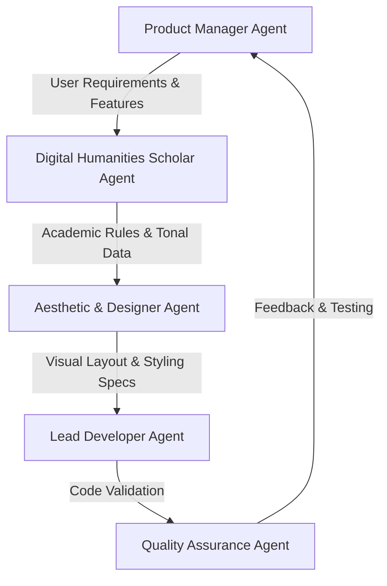

# Soundscape of the Past: Classical Chinese Poetry Tone & Rhyme Visualizer
## Multi-Agent Planning & Design Specification

This document details the multi-agent collaboration to design and build an interactive Digital Humanities web application for analyzing and visualizing the tonal patterns (平仄) and rhyming structures (押韵) of Classical Chinese Poetry.

---

## 👥 Meet the Agents

### 1. Product Manager (PM) Agent
*   **Role**: Define the project goal, user journey, and feature scope.
*   **Perspective**: Keep the website focused, easy to understand for both students and researchers, and fit the teacher's requirement of "clean, efficient, and meaningful."
*   **Key Decisions**:
    *   **Single Page Application (SPA)**: Avoid complex build systems. Use vanilla HTML/CSS/JS for instant load times and seamless GitHub Pages deployment.
    *   **Core Modules**:
        1.  *Tone Grid Analyzer (平仄交互棋盘)*: Interactive visual checker for poem rules.
        2.  *Rhyme Network (声律共振图谱)*: Dynamic visual link between rhyming characters.
        3.  *Imagery Word Cloud & Sentiment (意象与情感探微)*: Simple statistics on themes.
        4.  *Historical Context (数字人文知识窗)*: Explaining the DH methodology (close reading vs. distant reading).

### 2. Digital Humanities Scholar (DH) Agent
*   **Role**: Ensure historical and linguistic accuracy of the analysis algorithms.
*   **Perspective**: The app must demonstrate real academic depth. Just using Mandarin Pinyin tones is inaccurate for Classical poetry because of the **Entering Tone (入声)**—characters like “石”, “白”, “竹” are Tone 2 (Level/平) in modern Mandarin, but were short, abrupt Entering Tones (Oblique/仄) in Middle Chinese.
*   **Key Decisions**:
    *   **Mandarin & Middle Chinese Hybrid Engine**: Implement a smart parser that defaults to Mandarin Pinyin tones (1, 2 = 平; 3, 4 = 仄) but uses a curated dictionary of **Entering Tone (入声)** characters to automatically correct them to 仄 (Oblique).
    *   **Tonal Ruleset**: Encode the rules of *Five-character Quatrains* (五绝) and *Seven-character Quatrains* (七绝) for:
        *   平起首句入韵 (Level start, rhyming first line)
        *   平起首句不入韵 (Level start, non-rhyming first line)
        *   仄起首句入韵 (Oblique start, rhyming first line)
        *   仄起首句不入韵 (Oblique start, non-rhyming first line)
    *   **Rule Violation Alerts**: Detect and label poetic rule errors like *Lone Flat Tone* (孤平), *Three Levels in a Row* (三平调), and mismatch of *Sticking* (粘) and *Opposing* (对).

### 3. Aesthetic & Designer Agent
*   **Role**: Create the visual layout, typography, colors, and interactive aesthetics.
*   **Perspective**: Make the site feel like a premium, modern academic project. Use a fusion of **traditional Chinese aesthetics (国风)** and **modern clean minimalism (Glassmorphism)**.
*   **Key Decisions**:
    *   **Typography**: Use elegant serif fonts for poetry (e.g., `Noto Serif SC`, `Georgia`) and clean sans-serif for UI labels.
    *   **Color Palette**:
        *   *Background*: Deep Ink Wash / Charcoal Dark Mode (`#121314` base, with soft misty gradient overlays).
        *   *Card Background*: Semi-transparent frosted glass (`rgba(28, 30, 32, 0.7)` with `backdrop-filter: blur(12px)`).
        *   *Accents*: Jade Green (`#2e7d32` / `#4caf50`) for Level tones (平), Vermillion/Rust Red (`#c62828` / `#e53935`) for Oblique tones (仄), and Warm Amber/Gold (`#ffb300`) for rhyming indicators.
    *   **Animations**: Smooth micro-interactions. The poetry grid cells should subtly tilt or highlight on hover, and the network links should animate with a soft pulse.

### 4. Lead Developer Agent
*   **Role**: Implement the code, optimize performance, and structure files.
*   **Perspective**: Write modular, readable code. Keep files separated logically (Data, Logic, UI) but loadable directly by the browser to avoid dependencies and transpile overhead.
*   **Key Decisions**:
    *   **Data File (`data.js`)**: Contains presets for popular poems, standard Tone patterns, and the Entering Tone exception list.
    *   **Logic File (`app.js`)**: Implements the parser, Pingze rules, and chart drawing.
    *   **UI File (`index.html` & `style.css`)**: Implements responsive layout with flexbox/grid and clean custom components.
    *   **Visualizations**: Use lightweight SVGs created dynamically with JS. This avoids loading heavy charting libraries like D3 or ECharts, keeping the file size small and loading speed lightning-fast.

---

## 🗺️ Execution Roadmap

1.  **Phase 1: Project Setup & Data Base** (`data.js`)
    *   Add common poem presets (静夜思, 登鹳雀楼, 春晓, 枫桥夜泊, etc.).
    *   Compile the list of common Entering Tone (入声) characters that are Level tones in Mandarin (e.g., 国, 白, 石, 读, 独, 出, 席, 笛, 蝶, 极, 德, ...).
    *   Define the 4 standard tonal patterns for 5-character and 7-character quatrains.
2.  **Phase 2: Core Algorithm Development** (`app.js`)
    *   Write the tone parser: converts Chinese characters to Pinyin tones and identifies Ping (平) or Ze (仄) based on Mandarin + Entering Tone correction.
    *   Write the pattern matcher: compares the poem's Pingze with the standard template and returns matching/violating results.
3.  **Phase 3: Visual Interface & Styling** (`index.html`, `style.css`)
    *   Build a sleek header, selection controls, text input area, and interactive tabs.
    *   Implement the Interactive Tone Grid with tooltips explaining each character's properties.
    *   Implement the Rhyme Soundwave using SVG nodes.
4.  **Phase 4: Polishing & Testing**
    *   Verify responsive layout.
    *   Add smooth CSS animations.
    *   Confirm it can run locally by double-clicking `index.html`.
