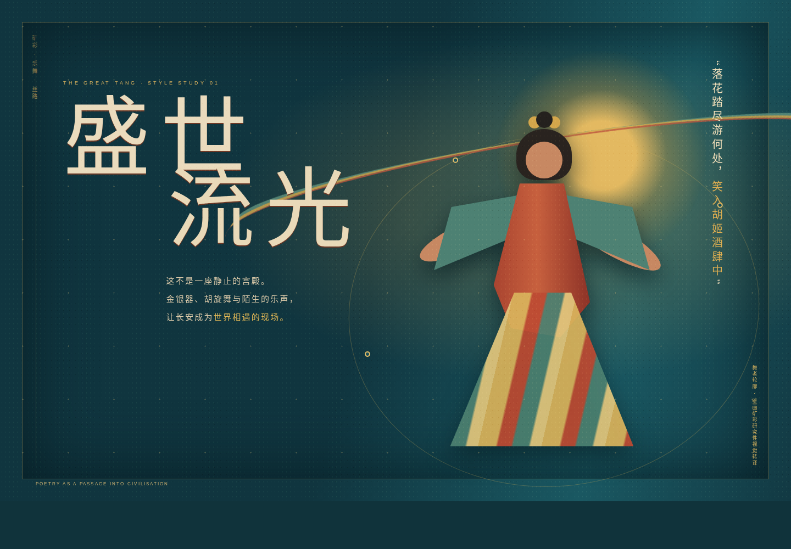
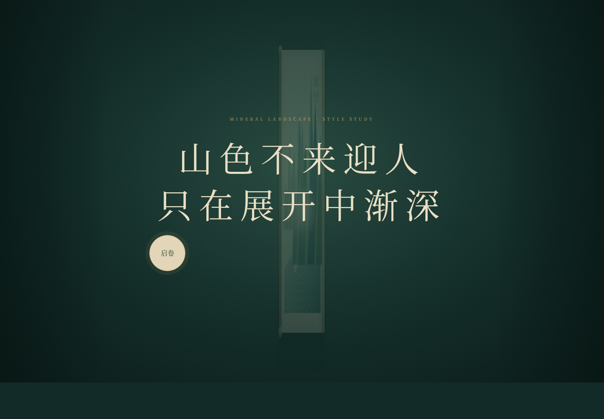
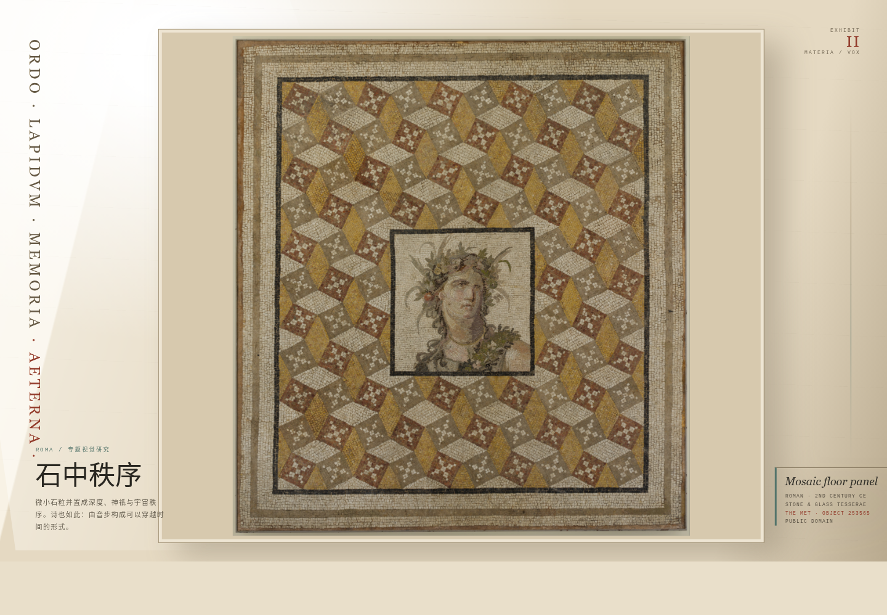
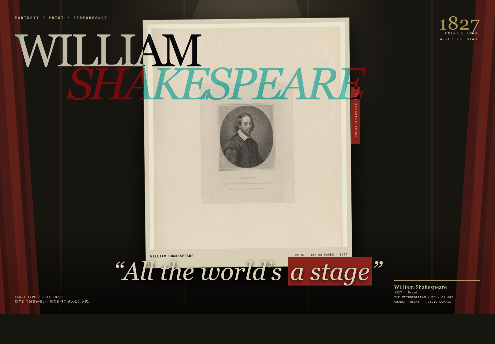

# 本轮评审目标

本文件用于小组选择未来网页的文化主题。当前展示的不是完整网页，而是四张彼此独立的**主题风格样片**。最终项目可能采用博物馆线上专题展的呈现方式：诗歌并非终点，而是进入器物、空间、制度、人物和时代生活的媒介。

方案由网页实现、审美策展和产品设计三个视角共同讨论。审美侧重点是主题辨识度、材质、构图和观看节奏；产品侧重点是观众路径、内容证据、交互价值和实现范围。

## 共同策展原则

1. 一句诗先吸引观众，再将观众带入具体文化对象。
2. 所有图片、器物、地图和史料均应注明出处与证据等级。
3. 交互必须帮助理解，不以“可玩性”取代文化内容。
4. 每个主题采用自己的观看方式，不套用统一网页模板。
5. 最终选择后再扩展完整内容；当前只比较主题潜力。

\newpage

# 主题一：大唐矿彩乐舞

{ width=100% }

**主题关键词：** 矿彩、乐舞、长安、丝路、器物、世界城市  
**项目气质：** 开放、繁盛、动态、国际化

## 未来网页如何呈现诗歌与文化

网页以“一首诗、一个时辰、一场文化事件”为范围。开场不是宫殿或帝王，而是一位矿彩舞者、一件乐器或一只金银器。诗句中的“胡姬”“羌笛”“银鞍”等词成为入口，观众沿词语进入人物身份、乐舞制度、服饰工艺、商路和长安生活。

建议采用“晨鼓—开市—宴游—夜禁”的时间节奏，但每个时辰只保留一个视觉主角。诗歌始终是解释文化对象的线索，不能退化成盛世背景字幕。

## 建议页面段落

1. **矿彩入场：** 舞者、乐器与诗句建立第一印象。
2. **一件器物的远行：** 沿材料、工艺和商路追踪文化迁移。
3. **乐舞分层：** 逐层呈现服饰、姿态、乐器和外来元素。
4. **长安现场：** 酒肆、市场、节令与坊市制度。
5. **盛世背面：** 仕途、边塞、离别及繁华背后的压力。
6. **余音：** 回到原诗，说明这些文化知识如何改变阅读。

## 关键交互与资料

- 最有意义的交互是“乐舞分层显影”，而不是装饰动画。
- 动效采用飘带缓移、矿彩颗粒显影和器物纹样分层。
- 声音只能由用户主动开启，并应对应具体乐器证据。
- 需要唐诗可靠版本、壁画与陶俑开放图像、馆藏元数据、乐器史、长安与丝路资料。

## 产品与审美约束

- 器物热点不超过 5 个，所有支线最终回到诗句解释。
- 人物、器物、路线不能同时抢夺画面；矿彩人物始终大于控件。
- 避免红金庆典风、宫殿剪影、龙凤纹样和空泛的“万国来朝”。
- 避免将不同年代、地域的材料混为一个想象中的盛唐。

**优势：** 视觉冲击力和文化密度最高，课堂展示效果强。  
**风险：** 资料整理与历史审核成本高，容易扩成“盛唐百科”。

\newpage

# 主题二：青绿江山手卷

{ width=100% }

**主题关键词：** 绢本、石青石绿、手卷、行旅、留白、诗画关系  
**项目气质：** 含蓄、诗性、缓慢、东方观看

## 未来网页如何呈现诗歌与文化

网页本身成为一幅可展开的长卷。用户沿诗人的视线移动，诗句在山、水、舟、楼、月等景物交汇处出现，再连接到历史地理、行旅制度、青绿设色、三远法和题跋流传。

诗与画不是互相配图，而是两种组织空间和时间的方法。主路径只保留“沿诗行游观”；画法、地理和题跋作为可选知识层，不应打断自然浏览。

## 建议页面段落

1. **启卷：** 用户主动展开，建立慢观看的仪式。
2. **江口：** 从水面留白进入平远视线。
3. **入山：** 随山径、瀑布和舟行进入高远与深远。
4. **人境：** 亭台、行旅与舟楫揭示山水中的生活秩序。
5. **画外知识：** 颜料、皴法、历史地名和研究注释。
6. **卷末题跋：** 作品的收藏、流传和后世观看。

## 关键交互与资料

- 横向拖动并在景物处“停驻式放大”。
- 用户停驻后，诗句、局部细节与文化解释逐层出现。
- 可切换诗意空间、历史地理和画法三个观察层。
- 需要高精度公版古画、诗歌版本、地理考据、颜料与画法资料。

## 产品与审美约束

- 任一视口最多出现一个主动提示，控件不得压入画心。
- 移动端采用分段停驻，不强行复刻超长横卷。
- 避免地图热点、进度奖励、自动吸附和强烈视差。
- 避免扁平多边形山、通用红印章、古风边框和名句拼贴。

**优势：** 中国诗歌、绘画与网页观看方式结合最自然；审美稳定，范围容易控制。  
**风险：** 高精度图像与移动浏览需要优化；内容不足时容易退化为唯美山水展示。

\newpage

# 主题三：罗马二世纪马赛克

{ width=100% }

**主题关键词：** 马赛克、石粒、格律、公共记忆、考古证据、地中海  
**项目气质：** 理性、明亮、纪念性、考古式

## 未来网页如何呈现诗歌与文化

网页从一件真实二世纪罗马马赛克出发。微小 tesserae 通过重复与秩序形成空间和人物，拉丁诗则通过音步形成可被记忆的声音。观众从材料和几何进入神话、公民身份、城市空间与公共记忆，再以私人抒情诗或讽刺诗修正帝国希望留下的宏大叙事。

藏品与诗歌必须具有地点、年代、题材或社会情境上的直接关联。报告和网页需要清晰区分“实物证据、语境关联、策展推测”，避免将形式相似误写成历史事实。

## 建议页面段落

1. **遗物初见：** 展示马赛克全景、尺寸、材质、年代与馆藏。
2. **石粒放大：** 进入材料、工艺、损坏与修复。
3. **几何与格律：** 谨慎比较图案节奏和拉丁诗音步。
4. **中央图像：** 解读神话、人物与公共身份。
5. **城市铭刻：** 延伸至道路、碑铭和纪念碑。
6. **私人声音：** 用诗歌中的欲望、流亡和时间焦虑修正公共叙事。
7. **考古边界：** 显示已知、推测和仍有争议的部分。

## 关键交互与资料

- 由整体放大到单枚石粒，再回到原始建筑语境。
- 可使用“碎片—研究性复原”叠合，但不能做游戏式 3D 拼装。
- 真实藏品在任何状态下都应占据至少半个主视区。
- 需要高清开放馆藏图、拉丁诗可靠译本、建筑语境、考古报告和学术审核。

## 产品与审美约束

- 每个关联都标明证据等级，不能把策展推测写成事实。
- 不使用无出处的精确地层数字。
- 避免 CSS 拱门、斗兽场剪影、SPQR 堆砌和黑白大棋盘。
- 避免混淆诗性“纪念碑”隐喻与真实公共铭文。

**优势：** 博物馆属性与材料研究感最明确，适合展示数字人文证据链。  
**风险：** 诗歌与藏品的直接联系最难建立，选材决定项目是否成立。

\newpage

# 主题四：莎士比亚——肖像、印刷与剧场

{ width=100% }

**主题关键词：** 肖像版画、活字、版本、角色声音、环球剧场、表演  
**项目气质：** 人文、戏剧性、编辑性、参与式

## 未来网页如何呈现诗歌与文化

肖像只作为展览门牌。用户进入后，第一个核心动作是让一句诗被排印并由角色说出：原始拼写、现代校本和中文翻译并置；随后文本离开纸面，进入演员呼吸、角色走位、观众结构与版本选择。

诗句不是固定注释对象，而是在出版、编辑、声音和身体中不断变化的文化事件。网页需要让观众亲自感受到“同一句诗，在书页、角色和舞台上拥有不同生命”。

## 建议页面段落

1. **肖像展签：** 从后世版画追问“我们如何认出莎士比亚”。
2. **一行活字：** 对照原始拼写、现代文本和中文翻译。
3. **文字离开纸面：** 诗句逐渐变成 cue script。
4. **舞台围合：** 演员位置和观众视线改变台词归属。
5. **多重声部：** 同一句话由不同角色重新解释。
6. **版本余波：** 出版、编辑和演出持续制造新的文本。

## 关键交互与资料

- 核心交互是“调度一句台词”：改变角色位置，观察声音、视线和解释变化。
- 每次只改变一个表演变量，原句始终位于视觉中心并保持可读。
- 音频由用户主动播放，必须提供文字转录。
- 需要可靠文本与译文、早期印本扫描、剧场结构、授权朗读和演出档案。

## 产品与审美约束

- 肖像不能主导完整网页，避免退化成作家生平展。
- 所有版本差异都要转译为可感知的语义或表演变化。
- 控制界面退居 cue desk，避免做成戏剧教学软件。
- 避免羽毛笔、墨水瓶、泛黄羊皮纸和深绿文学咖啡馆风。

**优势：** 文本、声音、舞台和版本构成最完整的数字人文产品链。  
**风险：** 音频、版本校勘和表演素材成本最高，整体实现难度大。

\newpage

# 综合比较与推荐

评分采用 1–5 分，5 分最佳；“落地友好度”越高代表越容易在课程项目范围内完成。

| 主题 | 视觉辨识度 | 诗歌到文化的延展力 | 交互独特性 | 馆藏资料适配度 | 落地友好度 |
|---|---:|---:|---:|---:|---:|
| 大唐矿彩乐舞 | 5 | 5 | 4 | 4 | 2 |
| 青绿江山手卷 | 5 | 4 | 5 | 4 | 3 |
| 罗马二世纪马赛克 | 5 | 4 | 4 | 5 | 3 |
| 莎士比亚剧场 | 5 | 5 | 5 | 5 | 2 |

## 两位 Agent 交叉评议后的建议

### 课程适配优先

1. **青绿江山**：视觉机制、文化方法与中文诗歌阅读最自然统一，范围相对可控。
2. **大唐盛世**：文化密度和展示冲击力更高，但史料、图像与动画成本更高。
3. **莎士比亚**：产品链完整、交互潜力大，但偏离中文诗歌课程且实现成本最高。
4. **罗马**：博物馆与考古属性清楚，但诗歌和具体藏品的证据关系最难处理。

### 数字人文交互创新优先

1. **莎士比亚**：文本版本、声音和表演天然适合数字交互。
2. **青绿江山**：手卷观看机制本身就是文化方法。
3. **大唐盛世**：适合文化交流与物质史叙事。
4. **罗马**：适合严谨的展品中心专题，但选材限制较大。

## 建议小组讨论的问题

1. 我们希望老师首先记住的是“中国审美”“盛唐文化”“博物馆研究”还是“文本互动”？
2. 小组是否能获得并校核足够的馆藏图像、历史资料和译文？
3. 我们更愿意投入时间制作高质量视觉，还是复杂音频与交互？
4. 项目范围能否坚持“一首诗或一组紧密相关文本”，避免百科化？
5. 最终选择是否符合课程原本对中文诗歌数字人文的要求？

## 当前综合推荐

若保持中文诗歌数字人文课程定位，建议优先选择**青绿江山手卷**，其次为**大唐矿彩乐舞**。青绿方案的观看方式本身具有文化意义，也更容易在有限范围内形成完整体验；大唐方案展示冲击力更强，但需要更严格的史料控制。

若小组希望转向国际文学或突出数字交互，则可以考虑**莎士比亚剧场**。罗马方案适合强调真实藏品、材料证据与考古研究的博物馆专题，但必须先找到与诗歌具有可靠联系的具体藏品与语境。

---

**截图与原型位置：** `prototypes/style-studies/`  
**讨论记录：** `planning/redesign_log.md`  
**参考方向：** [河南博物院](https://www.chnmus.net/) 的展品中心式专题展表达。本文未复制其页面结构。
